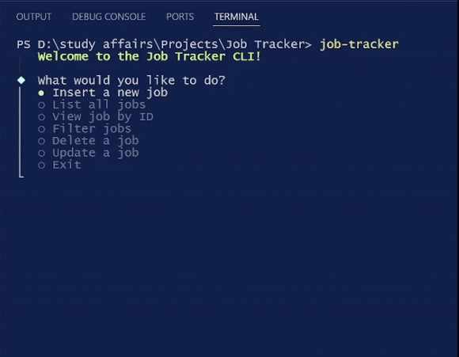
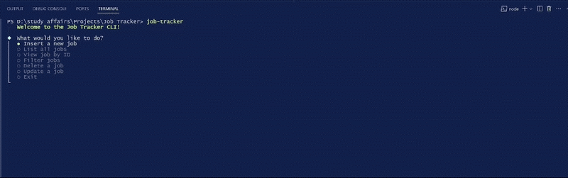
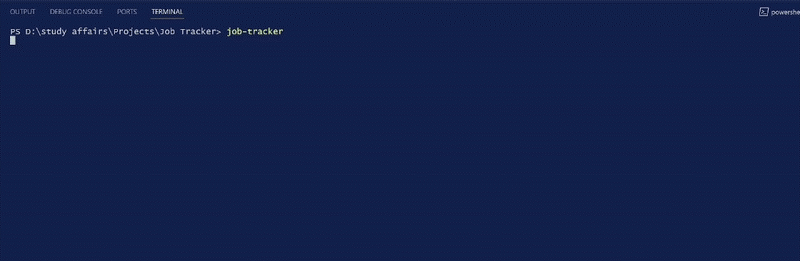

<p align="center">
  
</p>

# Functions

Now you can track your dream jobs

- Insert Job
- Delete
- Modify
- List && Filter

# How to install

- clone repo

```bash
git clone https://github.com/Omar-ahmed314/Job-Tracker
```

- install MongoDB and create jobTracker database and Jobs collection
- copy the connection string into .env file

```js
MONGODB_CONNECTION_STRING=<connection_string>
```

- run

```bash
npm install
npm link
job-tracker
```

# Usage

### insert job



### scaffold job


### filter job


### list jobs



### update job


### view by id job


